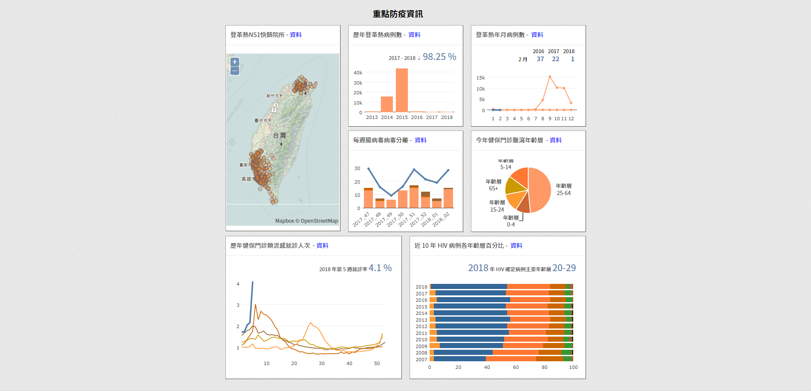

# Taiwan CDC Open Data Platform Visualization API


The repository is the process for generating visualization API data. After executing the program (e.g. crontab, etc.), the relative data would be generated and kept on the mysql server.

After the data is saved to the mysql server, a message would be sent to the admin over the LineNotify API.


## MySQL Sever Preparation


* database: opendataplatform

```mysql
create database opendataplatform default character set utf8;
create user 'user'@'%' identified by 'pwd';
grant all on opendataplatform.* to 'user'@'%';
```

* table **statusRecord**:

```mysql
create table statusRecord (servicename varchar(255), status varchar(255), starttimestamp varchar(255), endtimestamp varchar(255), note varchar(512)) default character set utf8;
```

* table **enterovirus**:

```mssql
create table enterovirus (yearweek varchar(255), coxsackie int, enterovirus int, positive double, others int) default character set utf8;
```

* table **influlinechart**:

```mysql
create table influlinechart (year int, week int, influop varchar(100)) default character set utf8;
```

* table **diarrheapiechart**:

```mysql
create table diarrheapiechart (year int, age varchar(100), diaval int) default character set utf8;
```

* table **hivbc**:

```mysql
create table hivbc (year int, age varchar(100), hivval int) default character set utf8;
```

* table **dengue**:

```mysql
create table dengue (year int, month int, dengueval int) default character set utf8;
```


## Preparation


* Create a new folder named **config**.


* Add a MySQL Server Configuration under **config/opendata.txt**, the exmaple is the following:

```
[mysql]
server = example.com
port = 3306
user = user
password = pwd
db = oddb
```


* Add a Line Configuration under **config/line.txt**, the example is the following:

```
[DevOps]
token = 0123456789abcdefghijklmnopqrstuvwxyz-+!@#$%
```


## Environment


* Python 2.x
* Necessary but not built-in Package (**need to download and install them**)
  * ntplib
  * mysql.connector
  * requests


## Scheduling / Execution


* Windows
  * Edit the opendataapi.bat with the execution path.
  * Edit the task scheduler (**Under Control Panel**) and use **opendataapi.bat** as the execution.


* Linux
  * Edit the opendataapi.sh with the execution path.
  * Edit the crontab (**/etc/crontab**).

```
10 8    * * *   user     sh /pwd/opendataapi.sh
```


## API Example


* The data API exmaple for enterovirus.


## Visualization

